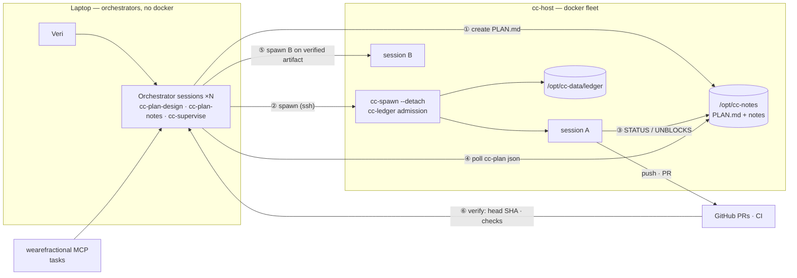
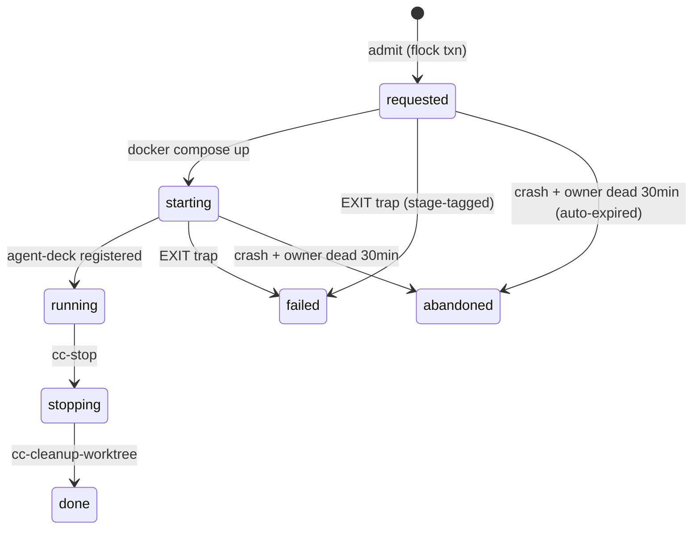
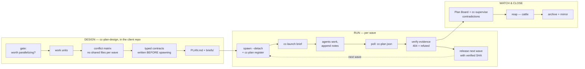

# The cc-dispatch fleet — architecture reference

*The consultable version of the Fleet Map (built and hardened 2026-08-27/28).
The live artifact with the drawn diagrams: the "cc-dispatch Fleet Map" in Claude
artifacts; the execution history: the "Fleet Hardening Plan" artifact and
`/opt/cc-notes/archive/`.*

## The system in one paragraph

One human, up to 4 laptop **orchestrator** sessions (Claude Code, running in
whatever client repo the work concerns), driving a fleet of docker **worker**
containers on cc-host over SSH/Tailscale. Each worker owns one repo/branch
worktree and runs an autonomous agent (Claude `ccd`, Codex `cxd`, OpenCode
`ocd`). Coordination is poll-based files, never keystroke injection; nothing
advances on an agent's word — only on mechanically verified artifacts; merges
are exclusively human.



## The spawn spine — two commands

```bash
ssh cc-host 'cc-spawn --detach git@github.com:owner/repo.git branch'
ssh cc-host 'cc-launch <session> --agent ccd --prompt-file -' < brief.md
```

`cc-spawn --detach` runs the whole pipeline synchronously and exits — no tmux
holding-windows, ever. `cc-launch` owns the TUI choreography: per-agent
readiness footer markers, codex's update-dialog skip, the paste→Enter loop
until the input clears (`--agent ccd|cxd|ocd|none`).

**Admission is one flocked cc-ledger transaction** — checks *and* reservation
together, so concurrent orchestrators cannot double-spawn or overcommit:

- no duplicate reservation for the same `repo@ref`
- concurrent starts < **2** · resident + pending sessions < **12**
- Σ admitted memory limits + request ≤ **48 GiB** (host: 62 GiB/12 threads)
- MemAvailable − request ≥ 8 GiB · disk ≥ 30 G · inodes ≥ 500k
- **fail-closed**: any probe error refuses
- env knobs: `CC_ADMIT_GB` `CC_MAX_SESSIONS` `CC_MAX_STARTS`

Per-spawn options: `CC_MEM_LIMIT=6g` (browser/build-heavy; default 4g),
`CC_TOKENS=vercel,railway,supabase` (deploy tokens are NOT default),
`CC_SCOPED_TOKEN=1` (single-repo ~1h GitHub App token; refuses rather than
silently falling back — see `docs/scoped-github-tokens.md`).



A clone/fetch/worktree section is additionally serialized by a **per-repo
lock** so parallel waves on one repo can't race the bare clone.

## A plan's life



**Protocol v1** (fleet CLAUDE.md, managed region). Notes are append-only,
single-writer per file; entries:

```
## 2026-08-27T14:03:00Z          ← FIRST line of file & entry, nothing above
STATUS: working|done|blocked     ← exactly this
<prose>
UNBLOCKS: <name> pr repo=<owner/repo> number=<N> head=<40-hex-sha>
UNBLOCKS: <name> commit repo=<owner/repo> sha=<40-hex-sha> path=<rel-path>
```

Free text after `UNBLOCKS:` is a legacy claim and **releases nothing**.
`cc-plan verify` checks PR head SHAs against GitHub (a missing PR is a
**refuted** claim, not "unverifiable") and commit+path against the local bare
repo. `done` without valid evidence = *done-unverified*.

**The worker Session workflow** (also in fleet CLAUDE.md) is judgment-first:
full arc (plan → sized subagent plan-review → implement → review/fix loop →
VERIFY-class testing → PR → merge-safety review) for hard work; simple work
skips the panels and says so. Two invariants always: verify the change works
(the brief's `VERIFY: browser|api|cli|lib` class), and **workers never merge**
— merging is Veri's decision; feedback returns via `cc-launch` to the resident
session.

## Where everything lives

| Path (cc-host) | What | Notes |
|---|---|---|
| `/opt/cc-notes/` | plans + notes (coordination truth) | git, hourly cron :17, mirrored to private `verimoreno/cc-notes`; mounted in every container |
| `/opt/cc-data/ledger/` | reservation state machine + `audit.log` | **not** mounted in containers — sessions can't forge admission |
| `/opt/cc-releases/` | versioned control plane | release dirs + `current` symlink; deploy checkout at `repo/` |
| `/opt/cc-sessions/` | compose, Dockerfile, tokens.d, `.env` (secrets) | compose files are symlinks through `current` |
| `~/Fractional/<repo>/` | bare clone + `wt-<branch>` worktrees | shared per-repo across that repo's sessions |
| cc-auth volume | fleet CLAUDE.md (managed region), agent auth | any content outside the managed region flags as drift |

## The tooling

| Command (on cc-host) | Job |
|---|---|
| `cc-spawn --detach <url> <branch>` | admission + worktree + container + registration, then exit |
| `cc-launch <session> --agent … --prompt-file -` | launch agent TUI + inject prompt, host-side |
| `cc-ledger list / show / set` | reservation state machine |
| `cc-plan list / json <plan> [--verify] / verify / register` | read-only plan projection + evidence checks + roster edits |
| `cc-reconcile [--fail-attempt --adopt]` | ledger × docker × agent-deck cross-check (read-only; repairs audited) |
| `cc-stop` / `cc-cleanup-worktree` | reap (→ ledger stopping/done) |
| `cc-github-token <owner/repo>` | mint single-repo ~1h App token |
| `host/deploy.sh [--check --rollback --list]` | deploy the control plane from git; `--check` = drift detector |
| `host/tests/run-tests.sh` | 33+ checks: parser fixtures, ledger integration, board smoke |

**Never hand-edit host files** — `/usr/local/bin/cc-*` and the compose files
are symlinks through `/opt/cc-releases/current`. Edit in this repo, then:
`ssh cc-host 'cd /opt/cc-releases/repo && git pull --ff-only && host/deploy.sh'`.

## The skills (laptop, symlinked from this repo)

`cc-plan-design` (think — in the client repo: gate, conflict matrix, contracts,
briefs) → `cc-plan-notes` (run — store mechanics, verify, release, archive) →
`cc-spawn-session` (the two-command spawn) → `cc-supervise` (watch — plan-aware
contradictions pass). Install elsewhere with `scripts/install-skills.sh`.

## Web UI

- `http://100.100.213.79:7822/` — dispatch dashboard (sessions, prompt/image
  injection, spawn picker; PageFab `n`)
- `http://100.100.213.79:7822/plans.html` — Plan Board: KPIs, per-plan cards,
  **LIST | GRAPH** toggle (dependency DAG: waves as columns, verified handoffs
  as green labeled edges), contradictions, 30s refresh

## Agent brands

| Agent | Launcher | Status | Protocol delivery |
|---|---|---|---|
| Claude Code | `ccd` | proven in production | fleet CLAUDE.md (automatic) + brief |
| Codex | `cxd` | proven (QA reviews) | brief (doesn't read CLAUDE.md) |
| OpenCode | `cc-arch`/`cc-code` → `ocd` | wired (admission, --detach, Go-subscription defaults) | brief |
| Gemini | — | needs launcher alias + cc-launch markers (~30 min) | brief |

## Security

See `docs/threat-model.md` (ranked residual risks + rotation runbook).
Standing state: deploy tokens opt-in per spawn; GitHub App scoped tokens
available; branch protection (no force-push/delete) on all org repos + public
personal repos; the ledger unreachable from containers; task metadata fenced as
untrusted in injected prompts.

## Kicking off a plan

See **`docs/kickoff-prompt.md`** — the paste-ready prompt that turns an
existing plan/PRD into a fleet-parallel plan via cc-plan-design, with the
stop-for-approval gate before anything spawns.
